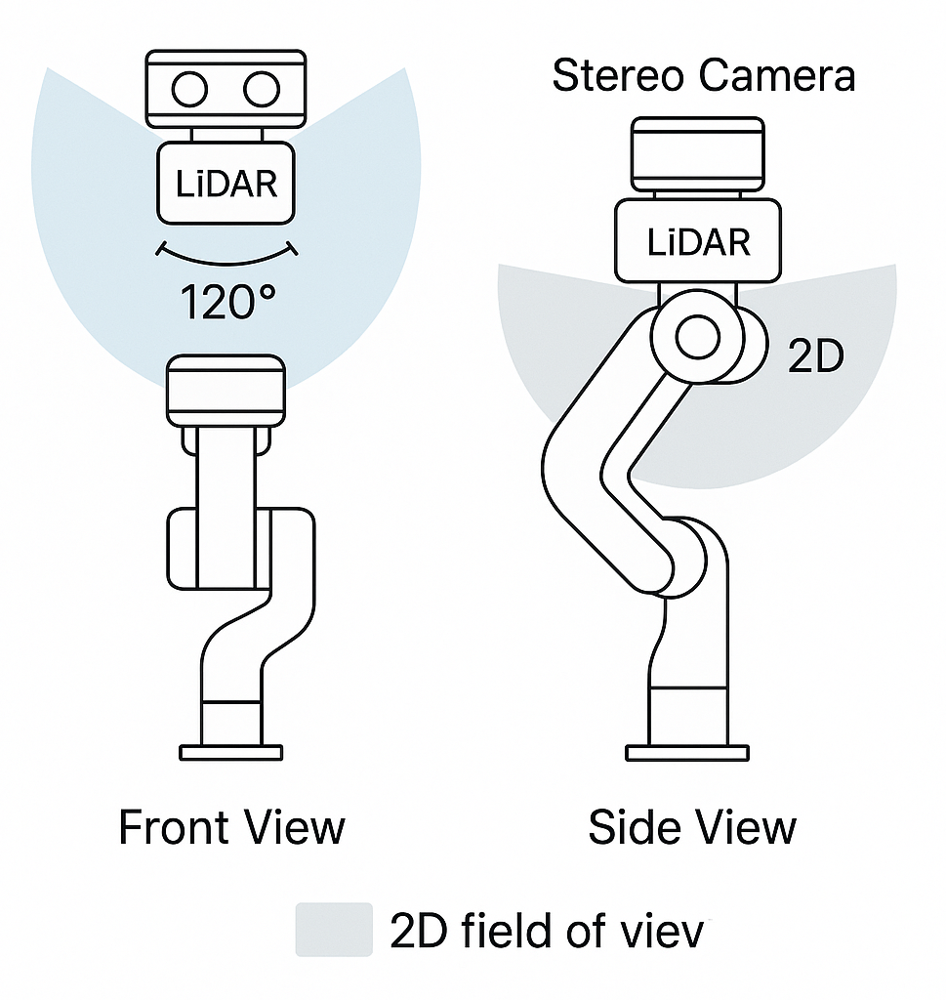

# 🤖✨ DeepSight-Nebula

**DeepSight-Nebula est un projet alliant Robotique & Intelligence Artificielle.**

---

## 🌌 Pourquoi le nom _DeepSight-Nebula_ ?

- 🔍 _DeepSight_ : fait référence à la **profondeur**, en écho au système de vision de ce projet.
- 🌠 _Nebula_ : en hommage aux **nébuleuses** objets céleste afin de refléter ma passion pour l’espace.

---

## 🎯 Objectifs de DeepSight-Nebula

Le projet a plusieurs ambitions :

- 🚀 M’améliorer en **robotique** et en **IA** de manière générale.
- 📚 Servir de base pour un **mémoire de fin de master** en _Big Data & IA_, et potentiellement préparer un **PhD en Robotique & IA**.
- 🦾 Concevoir un système capable de :
  - Piloter un **bras robotique** via une interface (comme un Raspberry Pi 🍓).
  - Utiliser un système de **vision** avec caméras et capteurs.
  - Déployer un **modèle d’IA** pour analyser les objets présents dans son champ de vision.
  - Ramasser les objets détectés **de manière autonome**… le tout avec un budget raisonnable 💰.

---

## 📝 Objectif de ce README

Ce document a deux fonctions principales :

- 📖 Résumer et clarifier le but du projet pour moi et pour les lecteurs.
- 🗒️ Servir de **journal de bord** pour documenter mes recherches et développements.

J’y consignerai :

- Des images 🖼️
- Des schémas 📐
- Des explications détaillées 📄
- Des solutions aux problèmes rencontrés 🧩
- … et peut-être même des questions que je me poserai en chemin 🤔

Je m’appuierai sur **ChatGPT** pour m’aider à rédiger, reformuler et améliorer ce document tout au long du projet.

---

## 📔 Journal de bord

### 🗓️ 22/07/2025

J’ai débuté mes recherches en réfléchissant à la conception et à la faisabilité de ce projet.

🔹 Dans un premier temps, je me suis penché sur le choix du bras robotique mais j’ai vite été freiné par les prix des modèles milieu de gamme.  
🔹 Ensuite, je me suis plutôt orienté vers la **détection et la vision par capteurs** en explorant plusieurs options :

- Lidar 2D ou 3D
- Caméra RGB-D
- Caméra stéréo
- Ou une combinaison de tout cela

Comme je souhaite utiliser un **Raspberry Pi** (qui me servira aussi pour d’autres projets), j’en ai conclu après plusieurs heures de recherche que je pourrais partir sur :

- 🎥 Une **caméra ELP stéréo** à ~125 €  
  [Lien Amazon](https://www.amazon.fr/ELP-distorsion-Synchronisation-dordinateur-Raspberry/dp/B07FT2GKZS?source=ps-sl-shoppingads-lpcontext&ref_=fplfs&psc=1&smid=A1XYWUUU38OZI5&gQT=1)
- 📡 Un **capteur TF-Luna** à ~29 €  
  [Lien Amazon](https://www.amazon.fr/youyeetoo-TF-Luna-Distance-d%C3%A9tection-industrielle/dp/B088BBJ9SQ)

👉 Je n’ai pas encore pris la décision de les acheter mais cela me donne une idée de la faisabilité et du budget.

👉 Je n'ai également pas choisi l'Intel RealSense car ses dimensions sont trop grandes pour être fixées sur un bras robot.

---

### 🔧 Réflexions techniques

💡 J’ai rapidement compris que la difficulté majeure sera la **calibration et la fusion des données** issues du lidar et des caméras.  
Je pars donc sur l’idée d’utiliser **Python ou C++ avec OpenCV (cv2)** avec une préférence pour Python notamment pour l’intégration des modèles d’IA.

- OpenCV me permettra de fusionner le flux des deux caméras et d’obtenir un output image exploitable.
- C’est ici que l’IA entre en jeu : après quelques recherche je vais probablement utiliser le modèle **YOLOWorld**, puis à terme entraîner mon propre modèle sur un dataset personnalisé (plus tard car c’est très chronophage).

Le modèle détectera un objet particulier sur le flux vidéo et retournera ses coordonnées **x** et **y**.  
Si aucun objet n’est trouvé dans le champ de vision le bras pourra bouger sur son axe pour balayer l’espace.

---

### 📏 Calibration & précision

- Il faudra calibrer l’ensemble (caméras + lidar) via un système de **calibrage extrinsèque** que je ne maîtrise pas encore.
- Pour commencer, je compte utiliser un **servo SG90 + Arduino** pour ajuster l’axe de la caméra afin de réduire l’angle entre l’axe central de la caméra et l’objet à environ 2° (l’angle max du TF-Luna placé juste en dessous de la caméra). Cela permettra de vérifier la profondeur avec plus de précision grâce au lidar.
- Je recalculerai ensuite les coordonnées **x**, **y** de l’objet en tenant compte de la calibration.
- Dans le futur le SG90 sera remplacé par un mouvement de la base du bras.

---

### 🤖 Mouvement & trajectoire

Avec les coordonnées **x, y, z** je pourrai déterminer un chemin pour le bras afin qu’il récupère l’objet sans doute en utilisant des vecteurs et des contrôleurs.  
Ces réflexions m’ont permis de voir que j’ai encore du temps et des alternatives avant d’investir dans un Raspberry Pi et un bras robot.

---

### 💰 Budget estimé

| Équipement                     | Prix approx. |
| ------------------------------ | ------------ |
| Caméra stéréo ELP              | 125 €        |
| Lidar TF-Luna                  | 29 €         |
| Bras robot (entrée/moyen)      | 60–200 €     |
| Raspberry Pi (+ alim, modules) | 150 €        |

**Total estimé : ~400 €**

---

### 🔜 Prochaines étapes

Je vais commencer par :

- Me familiariser avec le modèle **YOLOWorld** et OpenCV.
- Utiliser ma caméra actuelle (Logitech StreamCam) pour expérimenter.
- Je dois trouver un moyen de faire tenir ma caméra sur le SG90 de manière stable.
- Ajuster l’axe de la caméra pour entrer dans la plage de vision du lidar (~2°) après avoir détecté un objet avec **YOLOWorld** et calculer les premières coordonnées dans OpenCV.

---

### 🗺️ Schéma

La première grosse étape de ce projet sera d’apprendre à utiliser, avec ce que j’ai déjà à disposition, les outils (OpenCV, modèle IA, etc.), puis de passer à l’achat du lidar et de la caméra.  
L’objectif de cette étape est d’arriver à obtenir les **coordonnées 3D d’un objet** dans le champ de vision de la caméra.

Voici le schéma de la représentation de cette première étape que j’ai en tête :

---
