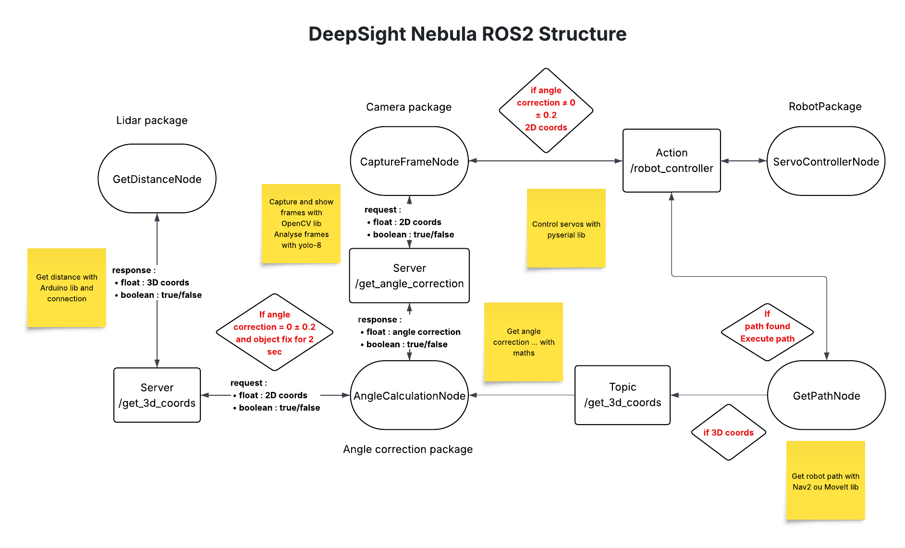
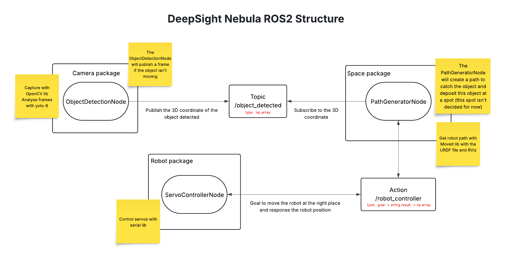
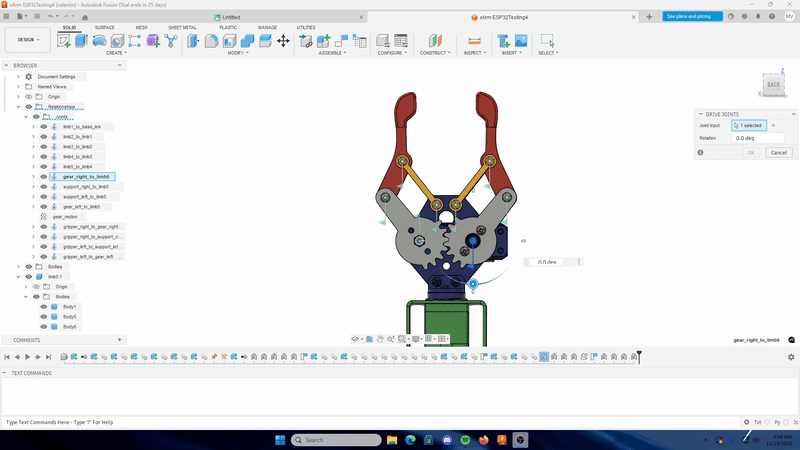

# 🤖✨ DeepSight-Nebula

---

## 📑 Table of Contents / Sommaire

### 🇬🇧 English Version

- [Why the name _DeepSight-Nebula_?](#-why-the-name-deepsight-nebula)
- [Goals of DeepSight-Nebula](#-goals-of-deepsight-nebula)
- [Purpose of this README](#-purpose-of-this-readme)
- [Logbook (English)](#-logbook)

### 🇫🇷 Version Française

- [Pourquoi le nom _DeepSight-Nebula_ ?](#-pourquoi-le-nom-deepsight-nebula-)
- [Objectifs de DeepSight-Nebula](#-objectifs-de-deepsight-nebula)
- [Objectif de ce README](#-objectif-de-ce-readme)
- [Journal de bord](#-journal-de-bord)

---

## 🇬🇧 English Version

**DeepSight-Nebula is a project combining Robotics & Artificial Intelligence.**

---

## 🌌 Why the name _DeepSight-Nebula_?

- 🔍 _DeepSight_: refers to **depth**, reflecting the project's vision system.
- 🌠 _Nebula_: refers to **nebulas**, celestial objects, to reflect my passion for space.

---

## 🎯 Goals of DeepSight-Nebula

The project has several goals:

- 🚀 To improve my skills in **robotics** and **AI** in general.
- 📚 To serve as a basis for a **master's thesis** in _Big Data & AI_, and possibly prepare for a **PhD in Robotics & AI**.
- 🦾 To design a system that can:
  - Control a **robotic arm** through an interface (like a Raspberry Pi 🍓).
  - Use a **vision** system with cameras and sensors.
  - Deploy an **AI model** to analyze objects in its field of view.
  - Pick up detected objects **autonomously**... all within a reasonable budget 💰.

---

## 📝 Purpose of this README

This document has two main functions:

- 📖 To summarize and clarify the project's goal for myself and for readers.
- 🗒️ To serve as a **logbook** to document my research and development.

I will record:

- Images 🖼️
- Diagrams 📐
- Detailed explanations 📄
- Solutions to problems encountered 🧩
- ... and maybe even questions I ask myself along the way 🤔

I will use **ChatGPT** to help me rephrase and improve this document throughout the project.

---

## 📔 Logbook

### 🗓️ 07/22/2025

I started my research by thinking about the design and feasibility of this project.

🔹 First, I looked into choosing a robotic arm but was quickly put off by the prices of mid-range models.
🔹 Then, I focused more on **sensor-based detection and vision**, exploring several options:

- 2D or 3D Lidar
- RGB-D Camera
- Stereo Camera
- Or a combination of all of these

Since I want to use a **Raspberry Pi** (which I will also use for other projects), I concluded after several hours of research that I could start with:

- 🎥 An **ELP stereo camera** for ~€125
  [Amazon Link](https://www.amazon.fr/ELP-distorsion-Synchronisation-dordinateur-Raspberry/dp/B07FT2GKZS?source=ps-sl-shoppingads-lpcontext&ref_=fplfs&psc=1&smid=A1XYWUUU38OZI5&gQT=1)
- 📡 A **TF-Luna sensor** for ~€29
  [Amazon Link](https://www.amazon.fr/youyeetoo-TF-Luna-Distance-d%C3%A9tection-industrielle/dp/B088BBJ9SQ)

👉 I haven't decided to buy them yet, but this gives me an idea of the feasibility and budget.

👉 I also did not choose the Intel RealSense (the most well-known stereo camera) because it is too large to be mounted on a robotic arm.

---

### 🔧 Technical Thoughts

💡 I quickly realized that the main difficulty will be the **calibration and fusion of data** from the lidar and cameras.
So, I'm planning to use **Python or C++ with OpenCV (cv2)**, with a preference for Python, especially for integrating AI models.

- OpenCV will allow me to merge the stream from the two cameras and get a usable image output.
- This is where AI comes in: after some research, I will probably use the **YOLOWorld** model, and later train my own model on a custom dataset (later, as it's very time-consuming).

The model will detect a specific object in the video stream and return its **x** and **y** coordinates.
If no object is found in the field of view, the arm can move on its axis to scan the area.

---

### 📏 Calibration & Precision

- The entire system (cameras + lidar) will need to be calibrated using an **extrinsic calibration** system, which I don't master yet.
- To start, I plan to use an **SG90 servo + Arduino** to adjust the camera's axis to reduce the angle between the camera's central axis and the object to about 2° (the max angle of the TF-Luna placed just below the camera). This will allow checking the depth more accurately with the lidar.
- I will then recalculate the object's **x**, **y** coordinates, taking the calibration into account.
- In the future, the SG90 will be replaced by a movement of the arm's base.

---

### 🤖 Movement & Trajectory

With the **x, y, z** coordinates, I can determine a path for the arm to retrieve the object, probably using vectors and controllers.
These thoughts helped me see that I still have time and alternatives before investing in a Raspberry Pi and a robotic arm.

---

### 💰 Estimated Budget

| Equipment                       | Approx. Price |
| ------------------------------- | ------------- |
| ELP Stereo Camera               | €125          |
| TF-Luna Lidar                   | €29           |
| Robotic Arm (entry/mid)         | €60–200       |
| Raspberry Pi (+ power, modules) | €150          |

**Estimated Total: ~€400**

---

### 🔜 Next Steps

I will start by:

- Getting familiar with the **YOLOWorld** model and OpenCV.
- Using my current camera (Logitech StreamCam) to experiment.
- I need to find a way to stably mount my camera on the SG90.
- Adjusting the camera's axis to get within the lidar's FOV (~2°) after detecting an object with **YOLOWorld** and calculating the first coordinates in OpenCV.

---

### 🗺️ Diagram

The first big step of this project will be to learn how to use the tools (OpenCV, AI model, etc.) with what I already have, then move on to buying the lidar and camera.
The goal of this step is to be able to get the **3D coordinates of an object** in the camera's field of view.

Here is the diagram of this first step as I imagine it:

---

### 🗓️ 11/03/2025

It's been 4 months since I wrote an update on this document, mainly due to lack of time and an intense learning phase.

---

### 🛠️ Learning & Development

These last few months have been dedicated to learning new skills and starting development on the robot.

- I purchased the xArm Esp32 robot arm from [Hiwonder](https://www.hiwonder.com/products/xarm-esp32?variant=39662930067543)

- **ROS2 Training**: I started learning **ROS2** by following this [YouTube tutorial](https://www.youtube.com/watch?v=Gg25GfA456o&t). I learned about the concepts of _nodes_, _publishers_, _subscribers_, _clients_, _servers_, and _actions_.
- **Robot Control**: Since the **xArm ESP32** arm doesn't have manufacturer software to make development easier, I had to learn how to retrieve the information passing through the USB ports.
  - Using the **COM8 Monitoring Session** software, I was able to analyze the commands sent by the robot's basic software.
  - This helped me understand which commands to send to control it. You can find this development in the `utils/xarm_esp32_init.py` file, which manages basic actions.
- **Math & AI**: I am currently taking math courses on Coursera ([Mathematics for Machine Learning and Data Science by DeepLearning.AI](https://www.coursera.org/specializations/mathematics-machine-learning-data-science)). As a Data & AI master's student, these courses will be essential, especially for my long-term goal of creating my own AI model.

---

### 🏗️ Architecture & Design

My thoughts on the hardware and software architecture have evolved a lot.

- **ROS Architecture Diagram**: I had made an initial diagram of my ROS architecture. It was just a starting point and definitely not a final solution.
  
- **Dropping the Lidar**: In the meantime, I decided to no longer use a Lidar sensor (like the TF-Luna).
  - The main reason is that the stereo camera will be sufficient to generate a **DepthMap** using OpenCV.
  - Also, the Lidar required very precise alignment (angle < 2°) between the camera, the gripper, and the object.
  - My first tests showed that the robot is not precise or robust enough for this. The weight, latency, and servo precision caused oscillations (back-and-forth movements) during calibration attempts, without ever succeeding. So, I will focus only on the stereo camera.
- **Camera Positioning**: I plan to install the stereo camera just below the gripper, attached to the servo that controls it.
  

---

### 💰 Hardware & Budget

The estimated budget is on track with the following purchases:

| Equipment              | Price     | Link                                                                            |
| ---------------------- | --------- | ------------------------------------------------------------------------------- |
| xArm ESP32 Robotic Arm | €229.99   | [Hiwonder](https://www.hiwonder.com/products/xarm-esp32?variant=39662930067543) |
| ELP Stereo USB Camera  | €125      | [Amazon](https://www.amazon.fr/dp/B07FT2GKZS)                                   |
| Raspberry Pi           | To buy    |                                                                                 |
| **Total (current)**    | **~€355** |                                                                                 |

These purchases fit well within the estimated €400 budget I mentioned earlier.

---

### 🗺️ Outline & Goals (Update)

With these new elements, the project's outline is becoming clearer:

1.  **Goal**: Autonomously pick up an object (a tennis ball to start).
2.  **AI (Vision)**: I will use **YOLOv8** (for its performance) for object detection.
3.  **Vision (Depth)**: The **stereo camera** and **OpenCV** will allow me to generate a DepthMap and get the object's **3D coordinates**.
4.  **Movement**: I will learn to use **URDF** files (to model the robot) and the **MoveIt** library (to plan the trajectory) to determine the optimal path to grab the object.
5.  **Future**: Eventually, I want to create my own AI model, possibly based on **reinforcement learning** (either for object recognition or for the complete grasping task).

---

### 🔜 Next Steps

Now that the ideas and technologies are clearer:

- Wait for my stereo camera to be delivered.
- Continue learning ROS2, especially **URDF files** and **MoveIt** (via the same YouTube channel).
- Learn 3D modeling or 3D printing to create a custom camera mount.
  - I will contact my school's innovation club, which offers training.
  - Alternatively, I will adapt an existing 3D model, like [this one](https://makerworld.com/en/models/27135-raspberry-camera-mount?from=search), and contact its creator to see if it's compatible.
- Redraw a more detailed global project architecture diagram.
- Try to contact Edouard Renard (robotics instructor) to ask his opinion on my architecture and ideas before developing.

---

### 🗓️ 11/08/2025

Progress continues, with advances in the vision part and the robot's modeling.

---

### 🛠️ Development & Vision

- **Stereo Camera**: I received my ELP stereo camera.
- **Test Script**: I was able to write a first script `utils/stereo_camera.py` that lets me initialize the camera and display the video feeds from both cameras.

---

### 🏗️ Architecture (Update)

I simplified my main architecture to make it more achievable for a first version.

- **New Architecture**:
  
- **Current Limitations**: In this setup, the robot is not capable of real-time operation. It will have to wait for the object to be picked up to be still, and to remain still during the entire movement.
- **V1 Goal**: I will stick to this approach for the first version of the project. Real-time trajectory correction will be an improvement for the future.

---

### 🦾 Modeling & URDF

Creating the robot's digital twin in ROS2 was a major and complex step.

- **URDF File**: I learned to write a `.xacro` file and build a ROS2 package.
- **3D Model**: The Hiwonder company provided me with the `.stp` file for my robot, which I opened in **Fusion360**.
- **Assembly**: I had to sort and assemble the 309 base parts into logical "components" (gripper, base, limb1, etc.) and create the joints between them.
- **Major Difficulty**: The default export script ([fusion2urdf](https://github.com/syuntoku14/fusion2urdf/tree/master)) does not accept Fusion's "as-built" joints. But I couldn't use simple joints because the parts were already assembled in the base `.stp` file.
- **Solution**: After 3 days of searching, I found a [GitHub issue](https://github.com/syuntoku14/fusion2urdf/issues/78) describing the same problem.
  - A big thank you to **Colin Fuelberth** ([@Infinite-Echo](https://github.com/Infinite-Echo)) who forked and adapted the script to support "as-built" joints!
  - **Script used**: [Infinite-Echo/ROS2_fusion2URDF](https://github.com/Infinite-Echo/ROS2_fusion2URDF/tree/URDF_Exporter_asBuilt_Support)
- **Result**: I was finally able to export a complete ROS2 package with a `.xacro` file that describes my robot arm, which is in the `modelisations/robot/xArm32_description` folder. This URDF does not include the gripper's opening and closing. I will adapt it when the time comes; the main goal was to have the basics and learn the Fusion software.

---

### 🔜 Next Steps

- I am currently following a **Blender** tutorial which will allow me to model and 3D print my own camera mount in the future.
- **Switch to Docker or Linux** (with a dual boot) for ROS2. I am way too limited with Windows, which doesn't make it easy, especially for opening and viewing my `.xacro`.

---

### 🗓️ 11/14/2025

I've continued working on the URDF model these last few days. I described the joints between the arm's segments (limbs) with limits, except for the gripper because understanding _mimics_ is a bit too complex for me right now. I'll probably control the gripper directly via the ESP32.

In the `app` folder, the first `joint_state_publisher_node` package is functional with the instructions.
I switched to Docker for ROS2 Humble, but I'm facing a frames-per-second (FPS) problem during simulation in RViz or Gazebo, which makes the user experience unpleasant.

You can find a zip file here containing the `.stp` provided by Hiwonder and the Fusion360 file I edited, in case modifications or improvements are needed: [Google Drive Link](https://drive.google.com/file/d/1qIVWolMBeF4Z5x8Bm8aadgIRzJTUaZLs/view?usp=sharing)

Thanks to this important step, I can visualize the main joints of the arm via RViz or Gazebo.
I don't think I will use Gazebo in this project.

---

### 🔜 Next Steps

- I am currently following a **Blender** tutorial that will allow me to model and 3D print my own camera mount in the future.
- Learn about **ros2_control** and **MoveIt**.
- Learn to use _mimic joints_, which would allow me to move the gripper in RViz as well. I have already started creating the necessary joints in Fusion for this, but the URDF format does not accept closed joint loops.

---

## 🇫🇷 Version Française

# 🤖✨ DeepSight-Nebula

**DeepSight-Nebula est un projet alliant Robotique & Intelligence Artificielle.**

---

## 🌌 Pourquoi le nom _DeepSight-Nebula_ ?

- 🔍 _DeepSight_ : fait référence à la **profondeur**, en écho au système de vision de ce projet.
- 🌠 _Nebula_ : référence aux **nébuleuses** objets céleste afin de refléter ma passion pour l’espace.

---

## 🎯 Objectifs de DeepSight-Nebula

Le projet a plusieurs ambitions :

- 🚀 M’améliorer en **robotique** et en **IA** de manière générale.
- 📚 Servir de base pour un **mémoire de fin de master** en _Big Data & IA_, et potentiellement préparer un **PhD en Robotique & IA**.
- 🦾 Concevoir un système capable de :
  - Piloter un **bras robotique** via une interface (comme un Raspberry Pi 🍓).
  - Utiliser un système de **vision** avec caméras et capteurs.
  - Déployer un **modèle d’IA** pour analyser les objets présents dans son champ de vision.
  - Ramasser les objets détectés **de manière autonome**… le tout avec un budget raisonnable 💰.

---

## 📝 Objectif de ce README

Ce document a deux fonctions principales :

- 📖 Résumer et clarifier le but du projet pour moi et pour les lecteurs.
- 🗒️ Servir de **journal de bord** pour documenter mes recherches et développements.

J’y consignerai :

- Des images 🖼️
- Des schémas 📐
- Des explications détaillées 📄
- Des solutions aux problèmes rencontrés 🧩
- … et peut-être même des questions que je me poserai en chemin 🤔

Je m’appuierai sur **ChatGPT** pour m’aider à reformuler et améliorer ce document tout au long du projet.

---

## 📔 Journal de bord

### 🗓️ 22/07/2025

J’ai débuté mes recherches en réfléchissant à la conception et à la faisabilité de ce projet.

🔹 Dans un premier temps, je me suis penché sur le choix du bras robotique mais j’ai vite été freiné par les prix des modèles milieu de gamme.  
🔹 Ensuite, je me suis plutôt orienté vers la **détection et la vision par capteurs** en explorant plusieurs options :

- Lidar 2D ou 3D
- Caméra RGB-D
- Caméra stéréo
- Ou une combinaison de tout cela

Comme je souhaite utiliser un **Raspberry Pi** (qui me servira aussi pour d’autres projets), j’en ai conclu après plusieurs heures de recherche que je pourrais partir sur :

- 🎥 Une **caméra ELP stéréo** à ~125 €  
  [Lien Amazon](https://www.amazon.fr/ELP-distorsion-Synchronisation-dordinateur-Raspberry/dp/B07FT2GKZS?source=ps-sl-shoppingads-lpcontext&ref_=fplfs&psc=1&smid=A1XYWUUU38OZI5&gQT=1)
- 📡 Un **capteur TF-Luna** à ~29 €  
  [Lien Amazon](https://www.amazon.fr/youyeetoo-TF-Luna-Distance-d%C3%A9tection-industrielle/dp/B088BBJ9SQ)

👉 Je n’ai pas encore pris la décision de les acheter mais cela me donne une idée de la faisabilité et du budget.

👉 Je n'ai également pas choisi l'Intel RealSense (caméra stéréo la plus connue) car ses dimensions sont trop grandes pour être fixées sur un bras robot.

---

### 🔧 Réflexions techniques

💡 J’ai rapidement compris que la difficulté majeure sera la **calibration et la fusion des données** issues du lidar et des caméras.  
Je pars donc sur l’idée d’utiliser **Python ou C++ avec OpenCV (cv2)** avec une préférence pour Python notamment pour l’intégration des modèles d’IA.

- OpenCV me permettra de fusionner le flux des deux caméras et d’obtenir un output image exploitable.
- C’est ici que l’IA entre en jeu : après quelques recherche je vais probablement utiliser le modèle **YOLOWorld**, puis à terme entraîner mon propre modèle sur un dataset personnalisé (plus tard car c’est très chronophage).

Le modèle détectera un objet particulier sur le flux vidéo et retournera ses coordonnées **x** et **y**.  
Si aucun objet n’est trouvé dans le champ de vision le bras pourra bouger sur son axe pour balayer l’espace.

---

### 📏 Calibration & précision

- Il faudra calibrer l’ensemble (caméras + lidar) via un système de **calibrage extrinsèque** que je ne maîtrise pas encore.
- Pour commencer, je compte utiliser un **servo SG90 + Arduino** pour ajuster l’axe de la caméra afin de réduire l’angle entre l’axe central de la caméra et l’objet à environ 2° (l’angle max du TF-Luna placé juste en dessous de la caméra). Cela permettra de vérifier la profondeur avec plus de précision grâce au lidar.
- Je recalculerai ensuite les coordonnées **x**, **y** de l’objet en tenant compte de la calibration.
- Dans le futur le SG90 sera remplacé par un mouvement de la base du bras.

---

### 🤖 Mouvement & trajectoire

Avec les coordonnées **x, y, z** je pourrai déterminer un chemin pour le bras afin qu’il récupère l’objet sans doute en utilisant des vecteurs et des contrôleurs.  
Ces réflexions m’ont permis de voir que j’ai encore du temps et des alternatives avant d’investir dans un Raspberry Pi et un bras robot.

---

### 💰 Budget estimé

| Équipement                     | Prix approx. |
| ------------------------------ | ------------ |
| Caméra stéréo ELP              | 125 €        |
| Lidar TF-Luna                  | 29 €         |
| Bras robot (entrée/moyen)      | 60–200 €     |
| Raspberry Pi (+ alim, modules) | 150 €        |

**Total estimé : ~400 €**

---

### 🔜 Prochaines étapes

Je vais commencer par :

- Me familiariser avec le modèle **YOLOWorld** et OpenCV.
- Utiliser ma caméra actuelle (Logitech StreamCam) pour expérimenter.
- Je dois trouver un moyen de faire tenir ma caméra sur le SG90 de manière stable.
- Ajuster l’axe de la caméra pour entrer dans la plage de vision du lidar (~2°) après avoir détecté un objet avec **YOLOWorld** et calculer les premières coordonnées dans OpenCV.

---

### 🗺️ Schéma

La première grosse étape de ce projet sera d’apprendre à utiliser, avec ce que j’ai déjà à disposition, les outils (OpenCV, modèle IA, etc.), puis de passer à l’achat du lidar et de la caméra.  
L’objectif de cette étape est d’arriver à obtenir les **coordonnées 3D d’un objet** dans le champ de vision de la caméra.

Voici le schéma de la représentation de cette première étape que j’ai en tête :

---

### 🗓️ 03/11/2025

Cela fait 4 mois que je n'ai pas rédigé de récapitulatif sur ce document, principalement par manque de temps et en raison d'une phase d'apprentissage intense.

---

### 🛠️ Apprentissage & Développement

Ces derniers mois ont été consacrés à l'acquisition de nouvelles compétences et au premier développement sur le robot.

- J'ai fait l'achat du bras robot xArm Esp32 de chez [Hiwonder](https://www.hiwonder.com/products/xarm-esp32?variant=39662930067543)

- **Formation ROS2** : J'ai commencé à me former à **ROS2** en suivant ce [tutoriel YouTube](https://www.youtube.com/watch?v=Gg25GfA456o&t). J'ai pu appréhender les concepts de _nodes_, _publisher_, _subscriber_, _client_, _server_ et _actions_.
- **Contrôle du Robot** : Le bras **xArm ESP32** n'ayant pas de logiciel constructeur facilitant le développement, j'ai dû apprendre à récupérer les informations transitant via les ports USB.
  - À l'aide du logiciel **COM8 Monitoring Session**, j'ai pu analyser les commandes envoyées par le logiciel basique du robot.
  - J'ai ainsi pu comprendre quelles commandes envoyer pour le piloter. Vous trouverez ce développement dans le fichier `utils/xarm_esp32_init.py` qui gère les actions de base.
- **Mathématiques & IA** : Je suis actuellement des cours de mathématiques sur Coursera ([Mathematics for Machine Learning and Data Science de DeepLearning.AI](https://www.coursera.org/specializations/mathematics-machine-learning-data-science)). Étant en master Data & IA, ces cours me seront essentiels, notamment pour mon objectif à long terme de créer mon propre modèle d'IA.

---

### 🏗️ Architecture & Conception

Mes réflexions sur l'architecture matérielle et logicielle ont beaucoup évolué.

- **Schéma d'architecture ROS** : J'avais réalisé un premier schéma de mon architecture ROS. Ce n'était qu'une base et absolument pas une solution finale.
  
- **Abandon du Lidar** : Entre temps j'ai pris la décision de ne plus utiliser de capteur Lidar (comme le TF-Luna).
  - La raison principale est que la caméra stéréo sera suffisante pour générer une **DepthMap** (carte de profondeur) via OpenCV.
  - De plus, le Lidar nécessitait un alignement très précis (angle < 2°) entre la caméra, la pince et l'objet.
  - Mes premiers tests ont montré que le robot n'est pas assez précis ou robuste pour cela. Le poids, la latence et la précision des servos provoquaient des oscillations (va-et-vient) lors de la tentative de calibrage, sans jamais y parvenir. Je vais donc me concentrer uniquement sur la caméra stéréo.
- **Positionnement de la caméra** : Je prévois d'installer la caméra stéréo juste en dessous de la pince, fixée sur le servo qui contrôle cette dernière.
  

---

### 💰 Matériel & Budget

Le budget estimé est respecté avec les achats suivants :

| Équipement                | Prix      | Lien                                                                            |
| ------------------------- | --------- | ------------------------------------------------------------------------------- |
| Bras robotique xArm ESP32 | 229.99€   | [Hiwonder](https://www.hiwonder.com/products/xarm-esp32?variant=39662930067543) |
| Caméra USB stéréo ELP     | 125€      | [Amazon](https://www.amazon.fr/dp/B07FT2GKZS)                                   |
| Raspberry Pi              | À acheter |                                                                                 |
| **Total (actuel)**        | **~355€** |                                                                                 |

Ces achats rentrent bien dans le budget estimé de 400€ que j'avais mentionné précédemment.

---

### 🗺️ Grandes Lignes & Objectifs (Mise à jour)

Avec ces nouveaux éléments, les grandes lignes du projet se précisent :

1.  **Objectif** : Attraper un objet (une balle de tennis pour commencer) de manière autonome.
2.  **IA (Vision)** : J'utiliserai **YOLOv8** (pour ses performances) pour la détection d'objet.
3.  **Vision (Profondeur)** : La **caméra stéréo** et **OpenCV** me permettront de générer une DepthMap et d'obtenir les **coordonnées 3D** de l'objet.
4.  **Mouvement** : J'apprendrai à utiliser les fichiers **URDF** (pour modéliser le robot) et la bibliothèque **MoveIt** (pour planifier la trajectoire) afin de déterminer le chemin optimal pour saisir l'objet.
5.  **Futur** : À terme, je souhaite créer mon propre modèle d'IA, potentiellement basé sur de l'**apprentissage par renforcement** (soit sur la reconnaissance de l'objet, soit sur la réussite de la saisie complète).

---

### 🔜 Prochaines étapes

Maintenant que les idées et les technologies sont plus claires :

- Attendre la livraison de ma caméra stéréo.
- Continuer à me former sur ROS2, notamment sur les **fichiers URDF** et **MoveIt** (via la même chaîne YouTube).
- Apprendre la modélisation 3D ou l'impression 3D pour créer un support de caméra adapté.
  - Je vais me rapprocher de l'association d'innovation de mon école qui propose des formations.
  - Alternativement, j'adapterai un modèle 3D existant, comme [celui-ci](https://makerworld.com/en/models/27135-raspberry-camera-mount?from=search), et je contacterai son créateur pour voir s'il est compatible.
- Refaire un schéma de l'architecture globale du projet plus détaillé.
- Essayer de contacter Edouard Renard (instructeur en robotique) pour lui demander un avis sur mon architecture et mes idées avant de développer.

---

### 🗓️ 08/11/2025

L'avancement continue, avec des progrès sur la partie vision et la modélisation du robot.

---

### 🛠️ Développement & Vision

- **Caméra Stéréo** : J'ai bien reçu ma caméra stéréo ELP.
- **Script de test** : J'ai pu écrire un premier script `utils/stereo_camera.py` qui me permet d'initialiser la caméra et d'afficher les flux vidéo des deux camérras.

---

### 🏗️ Architecture (Mise à jour)

J'ai simplifié mon architecture principale pour la rendre plus réalisable pour une première version.

- **Nouvelle architecture** :
  
- **Limites actuelles** : Dans cette configuration, le robot est incapable de faire du temps réel. Il devra attendre que l'objet à ramasser soit immobile et qu'il le reste pendant toute la durée du déplacement.
- **Objectif V1** : Je vais m'en tenir à cette approche pour la première version du projet. La correction de trajectoire en temps réel sera une amélioration pour le futur.

---

### 🦾 Modélisation & URDF

La création du jumeau numérique du robot dans ROS2 a été une étape majeure et complexe.

- **Fichier URDF** : J'ai appris à écrire un fichier `.xacro` et à construire un package ROS2.
- **Modèle 3D** : L'entreprise Hiwonder m'a fourni le fichier `.stp` de mon robot, que j'ai ouvert via **Fusion360**.
- **Assemblage** : J'ai dû trier et assembler les 309 pièces de base en "components" logiques (pince, base, limb1, etc.) et créer les joints entre eux.
- **Difficulté majeure** : Le script d'export par défaut ([fusion2urdf](https://github.com/syuntoku14/fusion2urdf/tree/master)) n'accepte pas les joints "as-built" de Fusion. Or, je ne pouvais pas utiliser de joints simples, car les pièces étaient déjà assemblées dans le fichier `.stp` de base.
- **Solution** : Après 3 jours de recherches, j'ai trouvé une [issue GitHub](https://github.com/syuntoku14/fusion2urdf/issues/78) décrivant le même problème.
  - Un grand merci à **Colin Fuelberth** ([@Infinite-Echo](https://github.com/Infinite-Echo)) qui a forké et adapté le script pour supporter les joints "as-built" !
  - **Script utilisé** : [Infinite-Echo/ROS2_fusion2URDF](https://github.com/Infinite-Echo/ROS2_fusion2URDF/tree/URDF_Exporter_asBuilt_Support)
- **Résultat** : J'ai enfin pu exporter un package ROS2 complet avec un fichier `.xacro` qui décrit mon bras robot qui se trouve dans le dossier `modelisations/robot/xArm32_description`. Ce URDF ne prend pas en compte la fermeture et l'ouverture de la pince. Je l'adapterai au moment venu, l'objectif premier était d'avoir les bases et d'apprendre le logiciel Fusion.

---

### 🔜 Prochaines étapes

- Je suis actuellement un tutoriel **Blender** qui me permettra à l'avenir de modéliser et d'imprimer en 3D mon propre support de caméra.
- **Passer via Docker ou Linux** (avec un dual boot) pour ROS2. Je suis beaucoup trop limité avec mon Windows qui ne me facilite pas la tâche, surtout pour ouvrir et visualiser mon `.xacro`.

---

### 🗓️ 14/11/2025

J'ai continué ces derniers jours sur le modèle URDF. J'ai décrit les joints entre les segments (_limbs_) du bras avec des limites, à l'exception de la pince car comprendre les _mimics_ est un peu trop complexe pour moi pour le moment. Je contrôlerai sûrement la pince via l'ESP32 directement.

Dans le dossier `app`, le premier package du `joint_state_publisher_node` est fonctionnel avec les instructions.
J'ai notamment effectué le changement vers Docker pour ROS2 Humble mais je rencontre un problème d'images par seconde (FPS) pendant la simulation sous RViz ou Gazebo, ce qui rend l'expérience utilisateur désagréable.

Vous trouverez ici un zip contenant le `.stp` fourni par Hiwonder et le fichier Fusion360 que j'ai édité si des modifications ou des améliorations sont à faire : [Lien Google Drive](https://drive.google.com/file/d/1qIVWolMBeF4Z5x8Bm8aadgIRzJTUaZLs/view?usp=sharing)

Grâce à cette étape importante, je peux visualiser les articulations principales du bras via RViz ou Gazebo.
Je ne pense pas me servir de Gazebo dans ce projet.

---

### 🔜 Prochaines étapes

- Je suis actuellement un tutoriel **Blender** qui me permettra à l'avenir de modéliser et d'imprimer en 3D mon propre support de caméra.
- Me renseigner sur **ros2_control** et **MoveIt**.
- Apprendre à utiliser des _mimic joints_ qui me permettraient de faire bouger la pince dans RViz également. J'ai déjà commencé à créer les joints nécessaires sur Fusion pour cela, mais le format URDF n'accepte pas les boucles de joints fermées.

---
